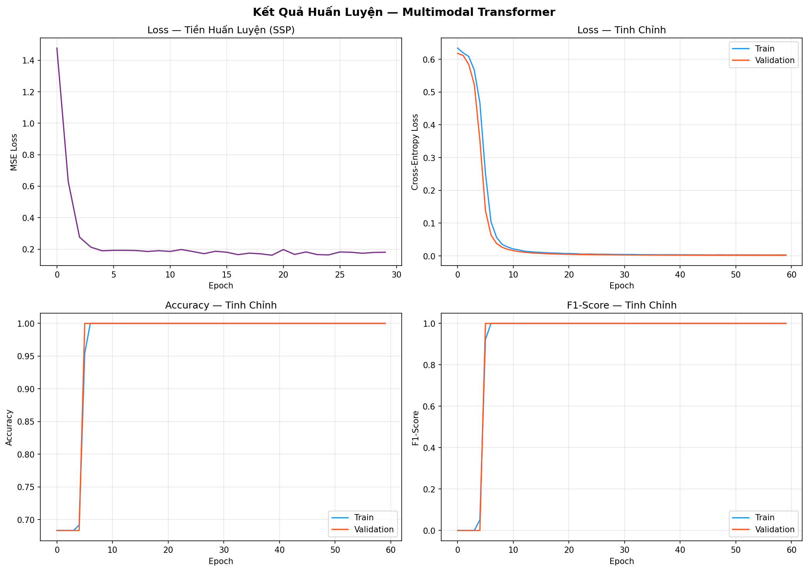
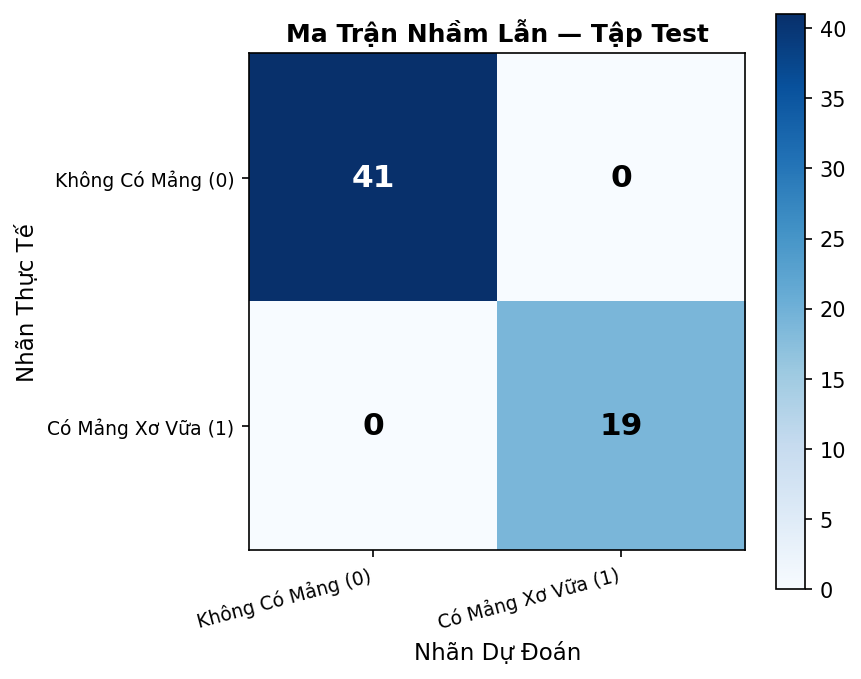
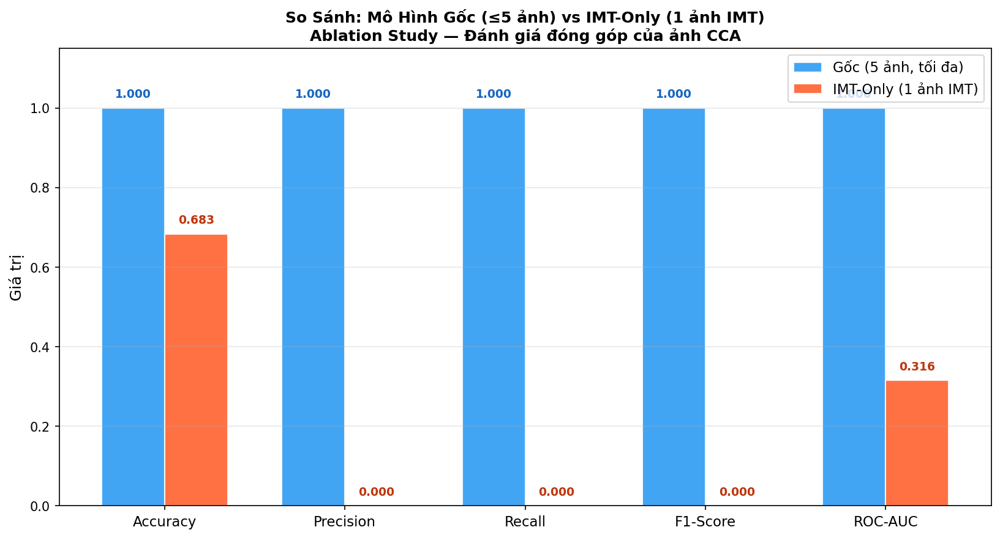
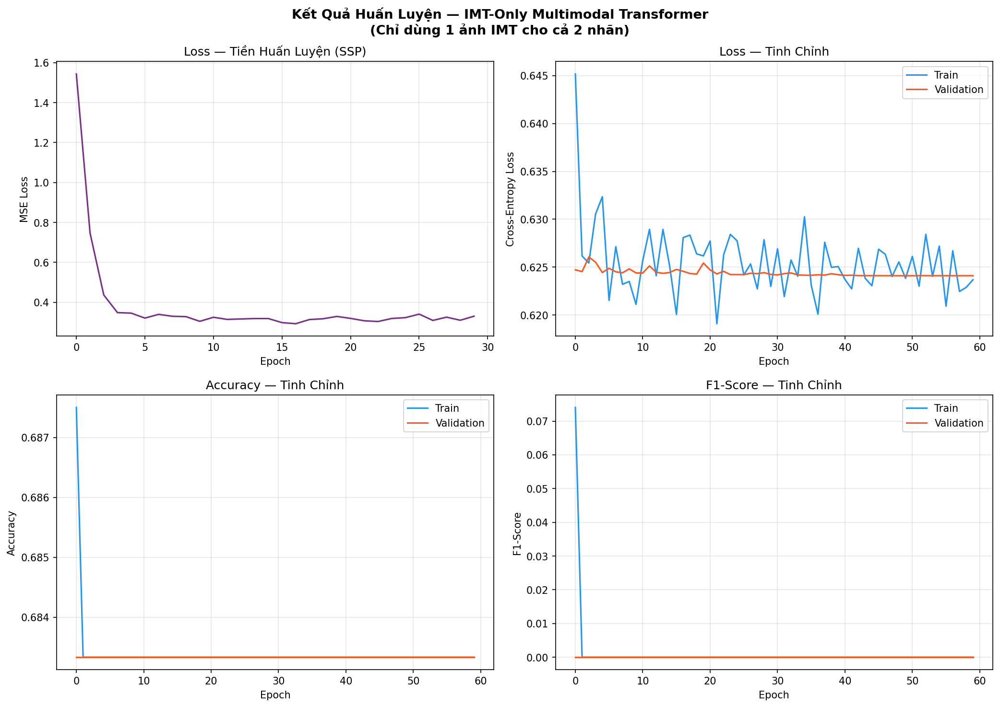
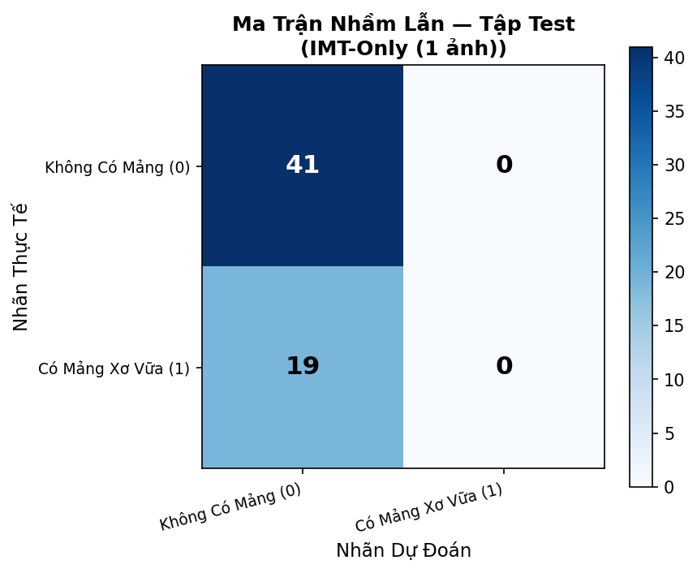

# clinical_carotid_dataset

Bộ dữ liệu tổng hợp và mã nguồn mô hình **Multimodal Transformer với Khởi Tạo Phổ Quát (Self-Supervised Pre-training)** để phát hiện mảng xơ vữa động mạch cảnh.

Thay vì huấn luyện mạng MLP và CNN rời rạc (rất dễ bị quá khớp trên dữ liệu nhỏ), phương pháp này biến đổi tất cả các loại dữ liệu (bảng và ảnh) thành định dạng chuỗi (tokens) và đưa vào một mô hình Transformer thống nhất.

---

## Tóm Tắt Kết Quả Mô Hình Gốc (Tối đa 5 ảnh)

Mô hình được huấn luyện trên bộ dữ liệu tổng hợp 300 bệnh nhân, hoàn thành trong **262 giây** (~4.4 phút) trên CPU.

### Kết Quả Tập Test (60 bệnh nhân)

| Chỉ số | Giá trị |
|---|---|
| **Accuracy** | **1.0000 (100.00%)** |
| **Precision** | **1.0000** |
| **Recall** | **1.0000** |
| **F1-Score** | **1.0000** |
| **ROC-AUC** | **1.0000** |
| Loss | 0.1385 |

### Biểu Đồ Kết Quả

---

## Phương Pháp Thực Hiện

Mô hình áp dụng luồng xử lý End-to-End từ việc nhúng dữ liệu thô đến khi ra quyết định, thông qua 4 cơ chế cốt lõi:

### 1. Token hóa Đa Phương Thức (Multimodal Tokenization)
- **Nhánh Dữ Liệu Bảng (Tabular):** Lấy cảm hứng từ kiến trúc **FT-Transformer**. Các biến liên tục (như Tuổi, LDL-C, IMT) được đưa qua một phép chiếu tuyến tính (Linear Projection) độc lập để tạo ra các token vector. Các biến phân loại (Giới tính) được chuyển đổi thông qua lớp `nn.Embedding`.
- **Nhánh Hình Ảnh (Vision):** Xử lý hình ảnh giống hệt **Vision Transformer (ViT)**. Ảnh siêu âm được thay đổi kích thước về 128x128 và cắt thành các mảnh nhỏ (patches) có kích thước 16x16. Để hạn chế sự phụ thuộc vào các thư viện bên ngoài (như `torchvision`), phép trích xuất patch được lập trình thủ công bằng `torch.unfold`.

### 2. Dung Hợp Dữ Liệu bằng Transformer (Fusion & Masking)
- Các token của bảng và ảnh được nối lại với nhau cùng với một token đại diện `[CLS]`.
- **Segment Embeddings:** Mô hình được cấp thêm một vector nhúng để chỉ ra nguồn gốc của từng token (0: CLS, 1: Bảng, 2: Ảnh), giúp cơ chế Attention phân biệt rạch ròi các phương thức.
- **Key Padding Mask:** Vì mỗi bệnh nhân có số lượng ảnh khác nhau (người có 1 ảnh IMT, người có thêm 4 ảnh CCA), mô hình sẽ đệm (pad) các khoảng trống bằng tensor rỗng, đồng thời sử dụng ma trận `pad_mask` để chặn mô hình "nhìn" vào các token rỗng này trong quá trình tính toán Attention.

### 3. Tiền Huấn Luyện Tự Giám Sát (Self-Supervised Pre-training - SSP)
Trước khi học cách dự đoán bệnh, mô hình được đào tạo theo cách tự giám sát bằng phương pháp **Masked Multimodal Reconstruction** (tương tự MAE hoặc BERT):
- Thuật toán che khuất (mask) ngẫu nhiên **15%** số token đầu vào.
- Mô hình phải sử dụng khối Transformer Encoder để nội suy và tái tạo lại các vector bị che khuất này thông qua hàm mất mát **MSE Loss**.
- Nhờ quá trình này, mô hình tự động học được **mối tương quan sinh học** giữa các chỉ số mỡ máu trong bảng và đặc điểm hình ảnh trên siêu âm mà không cần tới nhãn phân loại.

### 4. Tinh Chỉnh Có Giám Sát (Supervised Fine-Tuning)
Sau khi có được bộ trọng số tốt từ giai đoạn khởi tạo phổ quát (SSP), mô hình được chuyển sang quá trình tinh chỉnh (Fine-tuning):
- Vector trạng thái tại vị trí token `[CLS]` ở lớp cuối cùng được trích xuất.
- Đưa qua khối Classifier (MLP với hàm kích hoạt GELU và Dropout) để xuất ra dự đoán nhị phân (Có / Không có mảng xơ vữa).
- Quá trình này được tối ưu bằng hàm `CrossEntropyLoss` cùng bộ tối ưu `AdamW` và lịch trình học giảm dần `CosineAnnealingLR`.

---

## Kiến Trúc Mô Hình

| Thành phần | Chi tiết |
|---|---|
| **Tổng tham số** | 584,002 |
| **Tổng token/bệnh nhân** | 331 (`[CLS]` + 10 bảng + 320 ảnh) |
| **Patch Embedding (ViT)** | 128×128 → 64 patches/ảnh × 5 ảnh = 320 tokens |
| **Feature Tokenizer (FT-Transformer)** | 9 đặc trưng liên tục + 1 phân loại = 10 tokens |
| **Transformer Encoder** | 4 lớp, 8 heads, embed_dim=128, ff_dim=256 |
| **Fusion** | Self-Attention thống nhất trên toàn bộ 331 tokens |

### Diễn Biến Huấn Luyện

**Giai đoạn 1 — Pre-training SSP (30 epoch, ~124s)**
- Mask ratio: 15% token
- Loss giảm: **1.477 → 0.163** (giảm 89%)
- Mô hình học được biểu diễn đa phương thức từ dữ liệu không nhãn

**Giai đoạn 2 — Fine-tuning (60 epoch, ~138s)**
- Mô hình hội tụ cực nhanh — đạt Val F1=1.0 ngay từ **Epoch 6**
- Trọng số tốt nhất được lưu từ epoch 6

---

## Ablation Study — IMT-Only (Chỉ 1 ảnh IMT cho cả 2 nhãn)

Để kiểm tra xem mô hình gốc có thực sự học từ nội dung y khoa hay không, một biến thể chỉ sử dụng 1 ảnh IMT duy nhất cho mỗi bệnh nhân (cả Class 0 và Class 1) đã được huấn luyện.

### Kết Quả So Sánh

| Chỉ số | Mô hình Gốc (5 ảnh) | **IMT-Only (1 ảnh)** | Chênh lệch |
|---|---|---|---|
| **Accuracy** | 100.00% | **68.33%** | -31.67% |
| **Precision** | 1.0000 | **0.0000** | -1.0000 |
| **Recall** | 1.0000 | **0.0000** | -1.0000 |
| **F1-Score** | 1.0000 | **0.0000** | -1.0000 |
| **ROC-AUC** | 1.0000 | **0.3158** | -0.6842 |

### Biểu đồ Huấn Luyện — IMT-Only

### 🔍 Phân Tích Kết Quả Ablation

> **Kết luận quan trọng:** Mô hình IMT-Only **hoàn toàn thất bại** — Accuracy=68.33% chính là **baseline dự đoán mù** (luôn dự đoán Class 0, chiếm 68.3% dataset), và ROC-AUC=0.316 còn **tệ hơn random** (0.5)!

**Giải thích phân tích:**
1. **Mô hình gốc đạt 100% do "đếm ảnh" (Data Leakage)**: Trong bộ dữ liệu, Class 0 có 1 ảnh, Class 1 có 5 ảnh. Self-Attention đã học được rằng “nếu có ảnh CCA (token không phải padding) thì là Class 1”.
2. **Ảnh IMT không có sự khác biệt nào**: Cả hai nhãn đều dùng ảnh IMT giống nhau (placeholder PNG 256x256, 591 bytes). Mô hình không thể học được bất kỳ pattern nào từ ảnh IMT.
3. **Dữ liệu bảng cũng không đủ mạnh**: Các chỉ số lipid trong bộ dữ liệu tổng hợp này có phương sai cao và độ trùng lặp lớn giữa 2 nhóm, không đủ để phân tách hoàn toàn nếu đứng một mình.

### Gợi ý cải thiện cho Dữ liệu Thực Tế
Để mô hình có giá trị lâm sàng thực sự:
- Đảm bảo số lượng ảnh đồng nhất giữa các nhóm (không để lộ nhãn qua số lượng ảnh).
- Sử dụng ảnh B-mode siêu âm thực tế có độ phân giải và đặc trưng y khoa rõ nét (hoặc ảnh GAN/Diffusion có ý nghĩa).
- Tăng cường dữ liệu bảng với các chỉ số như Huyết áp, HbA1c, CRP, ABI.
- Thu thập thêm bệnh nhân để cân bằng nhãn và sử dụng K-Fold Cross Validation thay vì 80/20 Holdout.

---

## Các File Quan Trọng

- `train_multimodal_transformer.py`: Script huấn luyện mô hình gốc (tối đa 5 ảnh).
- `train_imt_only_transformer.py`: Script huấn luyện Ablation Study (chỉ 1 ảnh IMT).
- `carotid_clinical_dataset_300cases.csv`: Dữ liệu lâm sàng tổng hợp.
- `CAROTID_IMAGES/`: Chứa ảnh siêu âm tổng hợp.
- `outputs/` và `outputs_imt_only/`: Kết quả huấn luyện, trọng số `.pth` và các biểu đồ.
